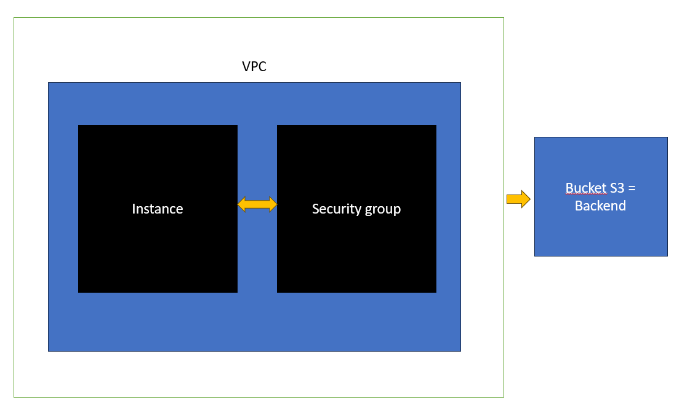
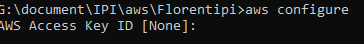

# AWS :technologist:

## Sujet

* Une instance EC2 / keys
* Un security group
* Un VPC
* Un backend
* Un code commenté
* Un fichier de variables
----------------------
## Préparation faite pendant le cours 
* création du bucket aws s3 *tpbucketflo*
* recherche des clé et clé secret de mon compte aws (extract excel)

   **A. Installation AWS CLI .exe téléchargé**

Configuration AWS CLI pour communiquer avec mon compte AWS via les clés trouvées dans *informations d'identification de sécurité*

   **B. Installation Terraform via cmd** 

lancement de la commande `terraform.exe` dans le repertoire ou se trouve le fichier d'installation .exe

------------------------
## Actions de configuration de Terraform selon le sujet 

* Une instance EC2 / keys
Description : Amazon Linux 2023 AMI 2023.3.20231218.0 x86_64 HVM kernel-6.1
type d'instance : t2.micro
ID AMI : ami-02ea01341a2884771

création d'une "Key" appelé cletp.pem 

* Un security group

* Un VPC

* Un backend

backend est le stockage désigné pour notre instance dans la région Europe de l'est n°3
  backend "s3" {
    bucket = "tpbucketflo"
    key    = "tfstate/tpbucketflo.tfstate"
    region = "eu-west-3"
  }

* Un code commenté

Voir les fichiers cloud.tf et ressources.tf

* Un fichier de variables

  Commande permettant d'appliquer les variables présents dans les deux fichiers .tf
`terraform apply -var-file="variables.tfvars"` 

[AIDE](https://developer.hashicorp.com/terraform/language/values/variables)

------------------------
## Problèmes rencontrés

1. Installation AWS CLI
    * pas d'explication ou de pop up à la fin de l'installation donc recherche et solution trouvé en utilisant la page web install aws cli --> commande `aws --version` dans le cmd
    * commande :x: donc recherche et relance du cmd puis commande :heavy_check_mark:
  
1. Installation terraform 
    * pas d'explication ou de pop up à la fin de l'installation donc recherche et solution donné dans le cours en exécutant le fichier exe dans le cmd.
    * en cmd je n'arrive pas à accéder au disque G (dossier avec où se trouve le fichier d'installation) avec la commande `cd G:` et recherche il faut utiliser la commande `G:` pour changer de disque
    * lancement de la commande `terraform.exe` :heavy_check_mark:

  

> [!NOTE]
> Useful information that users should know, even when skimming content.

> [!TIP]
> Helpful advice for doing things better or more easily.

> [!IMPORTANT]
> Key information users need to know to achieve their goal.

> [!WARNING]
> Urgent info that needs immediate user attention to avoid problems.

> [!CAUTION]
> Advises about risks or negative outcomes of certain actions.

   Aide pour la rédaction en .md [AIDE](https://docs.github.com/fr/get-started/writing-on-github/getting-started-with-writing-and-formatting-on-github/basic-writing-and-formatting-syntax) :wink:
